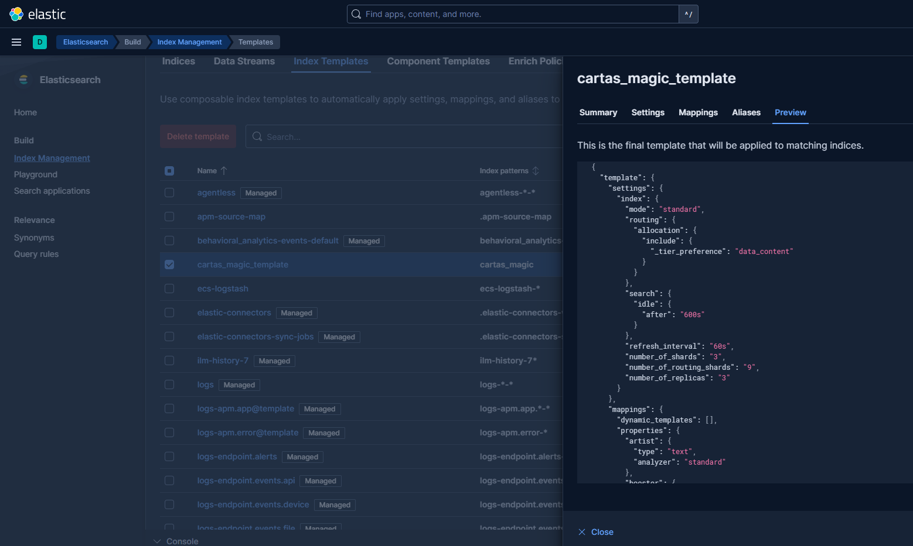
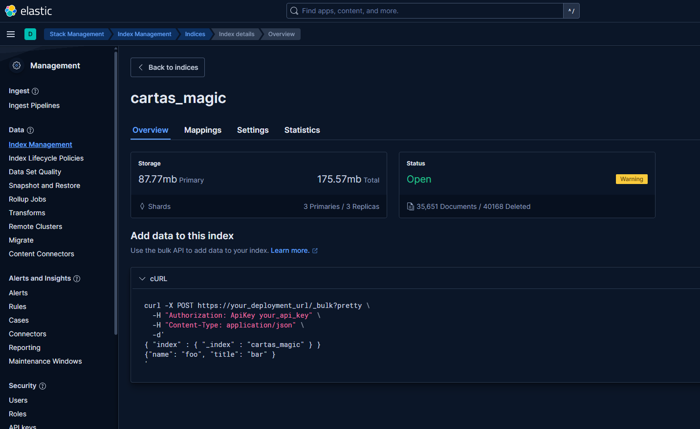

# Apartado de configuracion de elasticsearch
## Explicacion inicial

En esta carpeta Elasticsearch puedes encontrar los ficheros que han sido modificados a mano, comentados para mejor comprension.
Los ficheros editados son:

carpeta: elasticsearch
    - carpeta: conf
        - jvm.options
        - elasticsearch.yml

## Numero de nodos

Este proyecto presta de 3 nodos bajo el cluster Blind-Eternities:

    - Emrakul: 
        - ip: 192.199.1.55
        - roles: master, data, ingest
    
    - Kozilek: 
        - ip: 192.199.1.56
        - roles: master, data, ingest

    - Ulamog: 
        - ip: 192.199.1.57
        - roles: master, data, ingest

## Lifecycle policies
No hemos usado Lifecycle policies porque nuestros datos son relevantes en tod momento y no se van a volver obsoletos por como funciona el tema seleccionado.

## Carpeta queries
Dentro hay un txt con queries interesantes pertinentes al proyecto

## cartas_index
Dentro esta el mapping que hemos usado para nuestro indice y el resultado de aplicarlo como template.

Configurado el template

si vas a la pestaña de indices, creas un nuevo indice y lo nombras como se ha marcado en el template recoje el mapping y las configuraciones.

