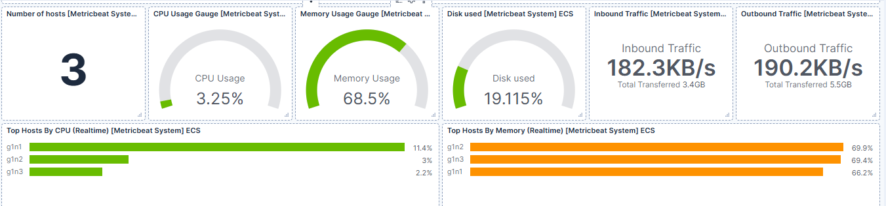
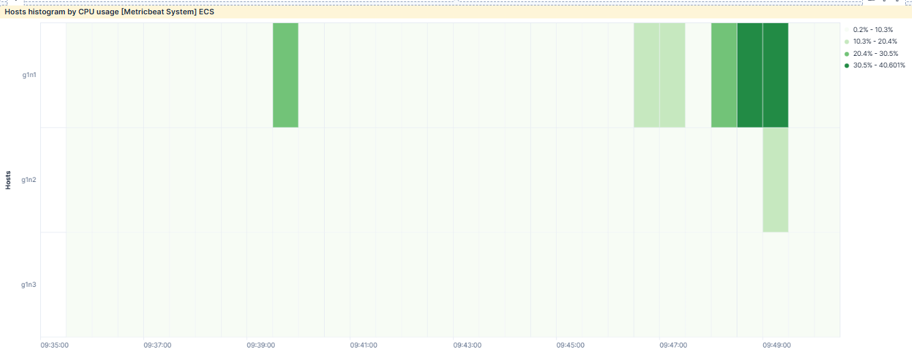
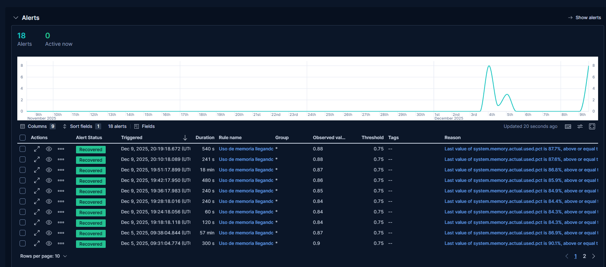

# Kibana

## kibana.yml
Dentro del .yml esta todo comentado y explicado, que parte se tiene que introducir y cual se auto-genera.

## api_keys
Api key generada en elastic a traves de kibana y utilizada por logstash.

## Metricas
Dashboards monstarndo informacion sobre las 3 VMs (CPU, RAM, trafico de red, espacio de disco libre, etc).

## dashboard 1:

(metricas varias)

## dashboard 2: 

(historiograma de uso de cpu por host)

## Dashboard_monitorizacion_estado_VMs.ndjson
Dashboard para monitorizacion de las maquinas.

## Alertas
Muestra de que las alertas saltan cuando el uso de la RAM supera el 75%

